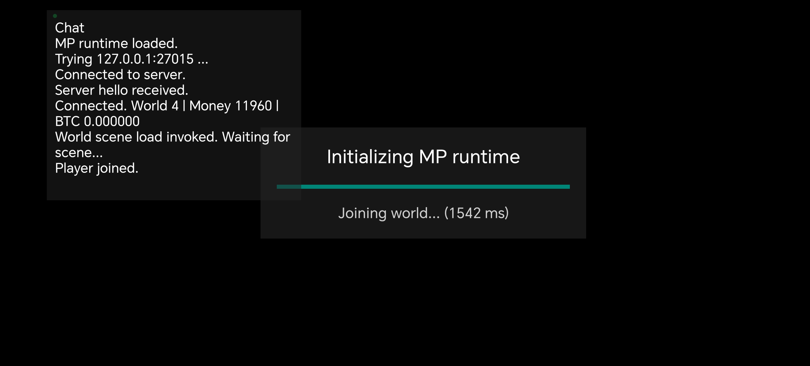
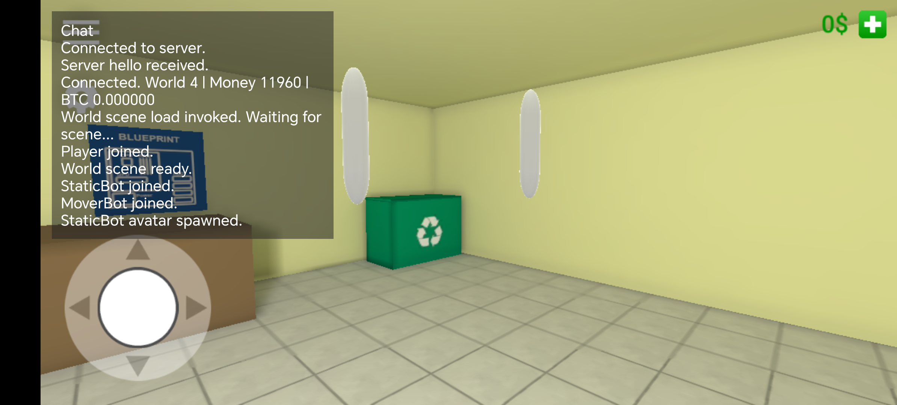
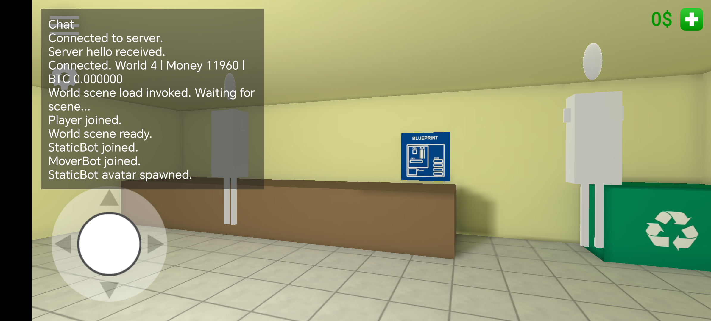
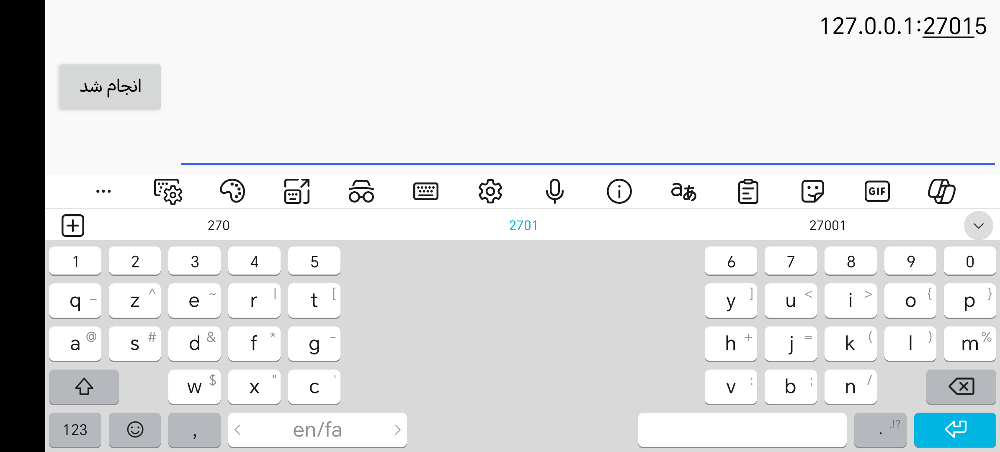

# PC Simulator MP (v0.1 WIP)

Reverse-engineered Android project for building an online multiplayer mod for PC Simulator.

## Project status
- Base game decompiled with JADX and imported into Android Studio.
- Native multiplayer patch is implemented in C++ (IL2CPP hook layer).
- Temporary multiplayer backend is implemented in Python.
- Current branch includes menu/connect flow, remote avatar sync, and first-pass server profile sync.

## Main components
- Native client patch: `app/src/main/cpp/module.cpp`
- Native build config: `app/src/main/cpp/CMakeLists.txt`
- Python MP server: `tools/mp_server_v0_1.py`
- Decompiled app shell/resources: `app/src/main/java`, `app/src/main/res`

## Work log (what has been done)
- Added custom MP connection menu (name + IP + connect).
- Added connect flow to join server-defined world/session.
- Added remote player avatar spawn/update pipeline.
- Added bot-based testing for multiplayer visibility.
- Added first iteration of server-side profile snapshot sync (money/bitcoin/inventory).
- Added runtime patch attempts for removing offline menu actions.
- Added avatar/perf throttling to reduce update spikes and lag.
- Added crash/pipeline logging paths to help debugging regressions.

## Run server
```bash
cd tools
python3 mp_server_v0_1.py
```

## Notes
- This is a research/reverse-engineering codebase and still **WIP**.
- Some systems are iterative and may still need stabilization in production gameplay.

## Screenshots




